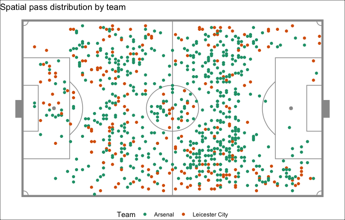

<!-- README.md is generated from README.Rmd. Please edit that file -->

# STA 323 & 523 :: Homework 03

## Introduction

Soccer analytics lags far behind the analytics communities in the four
major U.S. professional leagues (MLB, NFL, NBA, NHL). This is in part
due to the fact that much of the data is kept private and that data
collection, storage, and management have not been a priority for teams
and leagues. In this assignment, you’ll work with a subset of the
largest open collection of soccer-logs publicly available. Specifically,
match-event data from a game between Arsenal and Leicester City.

<center>



</center>

<br/>

The full set of publicly released datasets are provided by Wyscout and
can be accessed at
<https://figshare.com/collections/Soccer_match_event_dataset/4415000/2>.

## Tasks

### Part I

In this assignment, we are going to up your git and GitHub skill set by
using branches. Branching means you diverge from the main line of
development and continue working without touching that main line. For
simple and short projects, branching may not be necessary. However, if
you want to contribute to open-source projects or work on projects with
multiple lifecycles, using branches is almost a requirement.
Successfully using branches will make you a better programmer and will
demonstrate to others you have more than a surface level knowledge of
git.

<center>


</center>

To get started with branching, watch a short
[video](https://warpwire.duke.edu/w/8z0FAA/) available on warpwire. This
will walk you through the recommended team workflow for Homework 03. The
video doesn’t cover every technique and process involving branches, but
it is enough to get you started.

You are encouraged to use the `Terminal` rather than the `Git` pane in
RStudio.

### Part II

The following tasks will require you to manipulate and summarize a
subset of data provided by Wyscout. Before you get started, I suggest
you look at the variable descriptions under the events section at
<https://doi.org/10.1038/s41597-019-0247-7>.

Your code to manipulate and summarize the data should consist of
functions from base R and the external packages specified in the
template R Markdown file and given below.

``` r
library(tidyverse)
library(janitor)
library(jsonlite)
```

Code output should only contain the necessary rows and variables from
the data frame to answer the question or complete the task.

To get started, read in the events data in directory `data/` with the
following code. Function `read_json()` is from the `jsonlite` package.
Install it if necessary.

``` r
events_json <- read_json("data/events_england.json")
```

#### Task 1

Convert `events_json` to a tidy tibble using some functionals, where
each row is a recorded event in the match. Save the result as a tibble
object named `events`. Your tibble should match exactly to what you see
below when passed into `glimpse()`. Be sure your variable names are the
same, their ordering is the same, and the variable types are the same.
Any variables you don’t see below should not be included in your tibble.
Thus, you do not need to keep the `tag` variables. Some of the variables
have been renamed from what was originally provided; however, their
translation should be clear.

``` r
glimpse(events)
#> Rows: 1,768
#> Columns: 14
#> $ id             <chr> "177959171", "177959172", "177959173", "177959174", "1…
#> $ match_id       <chr> "2499719", "2499719", "2499719", "2499719", "2499719",…
#> $ match_period   <chr> "1H", "1H", "1H", "1H", "1H", "1H", "1H", "1H", "1H", …
#> $ team_id        <chr> "1609", "1609", "1609", "1609", "1609", "1609", "1631"…
#> $ event_id       <chr> "8", "8", "8", "8", "8", "8", "8", "1", "1", "8", "8",…
#> $ event_name     <chr> "Pass", "Pass", "Pass", "Pass", "Pass", "Pass", "Pass"…
#> $ sub_event_id   <chr> "85", "83", "82", "82", "85", "85", "82", "10", "10", …
#> $ sub_event_name <chr> "Simple pass", "High pass", "Head pass", "Head pass", …
#> $ player_id      <chr> "25413", "370224", "3319", "120339", "167145", "3319",…
#> $ event_sec      <dbl> 2.758649, 4.946850, 6.542188, 8.143395, 10.302370, 12.…
#> $ start_x        <int> 49, 31, 51, 35, 41, 72, 23, 39, 61, 67, 59, 45, 29, 71…
#> $ start_y        <int> 49, 78, 75, 71, 95, 88, 25, 15, 85, 80, 61, 45, 46, 54…
#> $ end_x          <int> 31, 51, 35, 41, 72, 77, 39, 33, 67, 59, 45, 71, 50, 50…
#> $ end_y          <int> 78, 75, 71, 95, 88, 75, 15, 20, 80, 61, 45, 54, 41, 59…
```

#### Task 2

Get a better understanding of the data by making use of `purrr`
functionals to verify that

  - no `NA` values exist for any of the variables in `events`,
  - no values for the numeric variables in `events` are less than 0, and
  - some values for the character variables of `events` have empty
    strings `""`.

#### Task 3

Use `across()` along with appropriate `dplyr` functions to convert every
character variable in `events` to be a factor. Mutate `match_period`
further to be an ordered factor where `1H < 2H`. Overwrite `events`.

#### Task 4

As explained in the reference, “The x and y coordinates are always in
the range \[0, 100\] and indicate the percentage of the field from the
perspective of the attacking team. In particular, the value of the x
coordinate indicates the event’s nearness (in percentage) to the
opponent’s goal, while the value of the y coordinates indicates the
event’s nearness (in percentage) to the right side of the field.”
Transform the coordinates to be on a scale of 105 x 68 meters. This is
the recommended Premier League pitch size. Overwrite `events`.

#### Task 5

Add a new variable to `events` called `team_name`. Arsenal and Leicester
City are defined by `team_id` values 1609 and 1631, respectively.
Overwrite `events`.

#### Task 6

For each team and half, provide a summary of the count for each level of
`event_name`.

#### Task 7

Compute the average distance per pass (ADP) and median distance per pass
(MDP) for passes traveling east and west. Do this for each team. Define
the east direction as the attacking direction. Hence, classify a pass as
having traveled east if `end_x > start_x`. Likewise, classify a pass as
having traveled west if `end_x < start_x`.

#### Task 8

Define the meaning of a possession. A few things to consider:

  - If a team makes one pass and loses the ball is that a possession?
  - If a team goes pass-pass-duel-duel-pass-pass is that a continued
    possession?
  - If a team earns a free kick, does that break up a possession into
    two separate possessions?

Once you have a set of rules to define a possession, compute the average
time of possession (ATP) and the average advancement of attack per
possession (AAAP) for each team. Define the advancement of attack as
`end_x` minus `start_x`.

There is no single correct answer here in how you define a possession,
so be creative. However, you should not simply define a possession as
when the `team_id` changes values; doing so will only earn you a quarter
of the points for this task.

## Essential details

### Deadline and submission

**The deadline to submit Homework 03 is Wednesday, February 17 at
11:59pm ET.** Only your final commit and code in the main branch will be
graded.

### Help

  - Post your questions in the \#hw3 channel on Slack. Explain your
    error / problem in as much detail as possible or give a reproducible
    example that generates the same error. Make use of the code snippet
    option available in Slack. You may also send a direct message to the
    instructor or TAs.

  - Visit the instructor or TAs in Zoom office hours.

  - The instructor and TAs will not answer any questions about this
    assignment within six hours of the deadline.

### Academic integrity

This is a team assignment. You may communicate with other teams in the
course. As a reminder, any code you use directly or as inspiration must
be cited.

To uphold the Duke Community Standard:

  - I will not lie, cheat, or steal in my academic endeavors;
  - I will conduct myself honorably in all my endeavors; and
  - I will act if the Standard is compromised.

Duke University is a community dedicated to scholarship, leadership, and
service and to the principles of honesty, fairness, respect, and
accountability. Citizens of this community commit to reflect upon and
uphold these principles in all academic and non-academic endeavors, and
to protect and promote a culture of integrity. Cheating on exams and
quizzes, plagiarism on homework assignments and projects, lying about an
illness or absence and other forms of academic dishonesty are a breach
of trust with classmates and faculty, violate the Duke Community
Standard, and will not be tolerated. Such incidences will result in a 0
grade for all parties involved as well as being reported to the
University Judicial Board. Additionally, there may be penalties to your
final class grade. Please review Duke’s Standards of Conduct.

### Grading

| **Topic**                              | **Points** |
| -------------------------------------- | ---------: |
| Task 1                                 |          6 |
| Task 2                                 |          3 |
| Task 3                                 |          2 |
| Task 4                                 |          1 |
| Task 5                                 |          1 |
| Task 6                                 |          2 |
| Task 7                                 |          4 |
| Task 8                                 |          6 |
| Made use of branches and pull requests |          2 |
| Code style and format                  |          3 |
| **Total**                              |     **30** |

*Documents that fail to knit after minimal intervention will receive a
0*.

## References

Pappalardo, L., Cintia, P., Rossi, A. et al. A public data set of
spatio-temporal match events in soccer competitions. Sci Data 6, 236
(2019). <https://doi.org/10.1038/s41597-019-0247-7>
